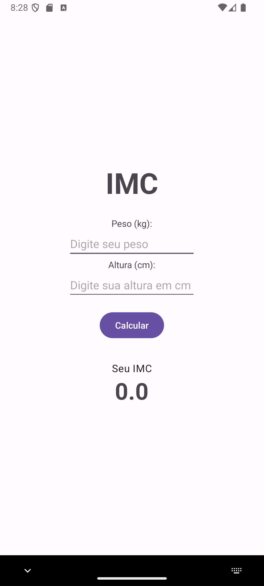
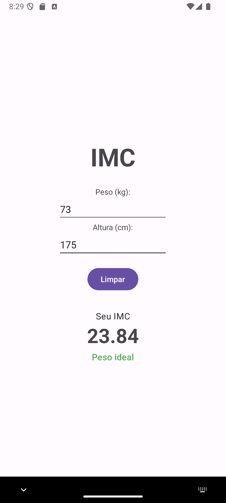
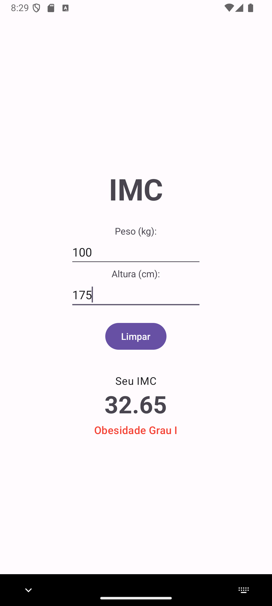

# Calculadora de IMC

Este é um projeto de aplicativo Android desenvolvido para a disciplina de Programação para Dispositivos Móveis da UTFPR.

- **Instituição:** Universidade Tecnológica Federal do Paraná (UTFPR)
- **Curso:** Especialização em Programação para Dispositivos Móveis
- **Disciplina:** PM-IV - ANDROID BÁSICO
- **Professor:** Prof. Robison Cris Brito

---

## 📝 Sobre o Projeto

O aplicativo **Calculadora IMC** é um projeto introdutório ao desenvolvimento Android que permite ao usuário calcular seu Índice de Massa Corporal (IMC). O usuário insere seu peso em quilogramas (kg) e sua altura em centímetros (cm). Com base nesses dados, o aplicativo calcula o IMC, exibe o resultado e fornece uma classificação sobre a faixa de peso do usuário (ex: Abaixo do peso, Peso ideal, Obesidade).

## ✨ Funcionalidades

- Entrada de peso (kg) e altura (cm).
- Cálculo do IMC com base nos valores fornecidos.
- Exibição do resultado do IMC com destaque.
- Apresentação da classificação do IMC com cores indicativas (ex: verde para peso ideal, vermelho para obesidade).
- Botão de cálculo que se transforma em um botão de "Limpar" após o cálculo, melhorando a usabilidade.
- Interface de usuário limpa e centralizada.

## 📷 Screenshots

  
  
  

## 🛠️ Tecnologias e Conceitos Aplicados

- **Linguagem:** Kotlin
- **Interface Gráfica:** XML
- **Arquitetura de UI:**
    - `LinearLayout` para estruturação e alinhamento centralizado com `gravity`.
- **Componentes de UI (Views):**
    - `TextView`, `EditText` e `Button`.
- **Lógica e Interação:**
    - **Tratamento de Eventos:** Uso de `setOnClickListener` para responder a interações do usuário.
    - **Validação de Entrada:** Verificação de dados nulos ou inválidos (<= 0) para garantir a robustez do cálculo.
    - **Manipulação Dinâmica da UI:**
        - Alteração da visibilidade dos botões (`View.GONE`, `View.VISIBLE`) para criar uma interface contextual.
        - Atualização de texto e cor do `TextView` de classificação em tempo de execução.
- **Melhorias de Usabilidade (UX):**
    - Feedback visual com cores para a classificação do IMC.
    - Lógica de troca de botões (Calcular/Limpar) para simplificar a interface.

---

Desenvolvido como o primeiro aplicativo prático para consolidar os conhecimentos básicos em Kotlin e XML para Android.
